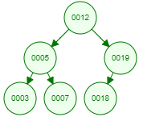
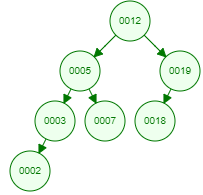
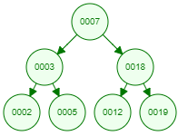
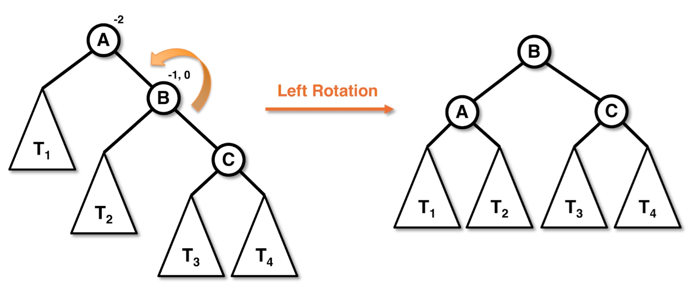
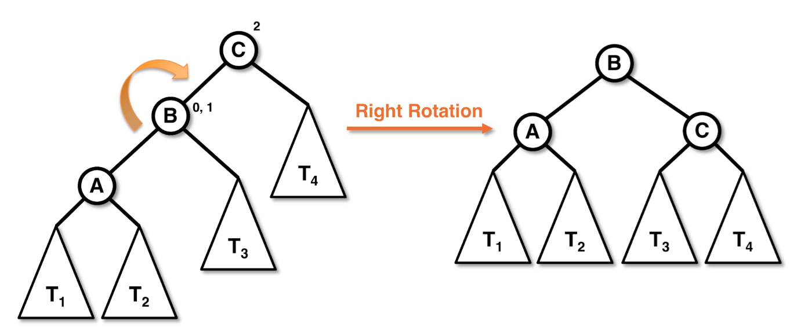

# AVL Trees

* Recall that BSTs can become unbalanced depending on the order that nodes are inserted.
    * Because of this, the best we could do for the runtimes of BST operations was a guarantee of $O\left(h\right)$ runtime, where $h$ is the height of the tree.
    * In the worst case, $h = O\left(n\right)$, which happens when our BST looks more like a linked list.
    * We *could* say that $h = \lg n$ "on average" (see the theorem proved in the [BST Operations note](./9.BSTOperations.md)), but we generally prefer worst case guarantees.

* To maintain a balanced BST efficiently, we need to figure out some local property of nodes in our tree that can which can be propagated in a way to affect a global state on the tree without breaking the $O\left(\lg n\right)$ runtime of BST operations that this balance would give us.
    * Such a tree is called "self-balancing" because its operations include some extra steps that fix any violations of these properties.

* The example we will see is that of the *AVL Tree* data structure (named after the creators, **A**delson-**V**elsky and **L**andis), which considers an extra property to be satisfied on nodes and a new operation, called a *rotation*, to make sure that property is maintained.

## Heights & Balance Factors

* The *height* of a node is `height(node) = 1 + max{height(node.left), height(node.right)}`, where we have the base case `height(null) = -1`.

* The *balance factor* of a node is the difference in heights between the two subtrees, `balanceFactor(node) = height(node.left) - height(node.right)`.

* We store these extra properties inside of the node.
    * This way, as updates are made to the tree, we need only spend $O\left(1\right)$ time to get these values.
    * Technically, since calculating the balance factor is, itself, an $O\left(1\right)$ operation, we can get away with storing only the heights at each node.

* When the absolute value of the balance factor is greater than 1, the tree is unbalanced.
    * Furthermore, the sign says where the imbalance originates.
        * If it is negative, then the imbalance is from the right.
        * If it is positive, then the imbalance is from the left.

* Why 1 instead of 0?
    * Only when we have $n = 2^{k} - 1$ nodes, for some $k\geq 0$, is it possible for the balance factor of every node to be exactly 0.
    * For example, any tree with 2 nodes will be "unbalanced" if we don't allow a balance factor of 1.

* Should we ever be okay with a balance factor of 1 if 0 at every node is possible?

Consider the following BST:



If we add `2` to it, we get the following:



If we demanded that our BST must be made perfectly balanced whenever possible, we *could* get this tree:



However, note that we would have to move *every* node, which makes this operation take $O\left(n\right)$ time. We wanted our tree to be balanced in order to maintain $O\left(\lg n\right)$ runtimes, and so making the tree perfectly balanced would actually go against our goal.

* Therefore, maintaining a balance factor of *at most 1* is better than trying to always have a balance factor of 0. In most cases, it's not possible to maintain a balance factor of 0, and, even when it is, it can actually be a major pessimization.

## AVL Rotations

* In order to maintain a balance, we have to move nodes around in some way. The move we introduce here is known as a *rotation*, because it seemingly "rotates" a node, its children, and its parent around.

### Single Rotation

* There are two "directions" we can rotate, left or right.

* For a left rotation, consider the following image:



* What happens, mechanically, is we left rotate `A` by taking its right child, `B`, turning it into the parent of `A`, turning `A` into the left child of `B`, and moving what used to be the left subtree of `B` over to become the right subtree of `A`.
    * This makes sense because the left subtree of `B` are the nodes that come to the right of `A`, but to the left of `B`.
    * All other subtrees stay in their same relative position, with only the one subtree being re-rooted at `A`.

* After rotating, we make sure to update the heights of our nodes.

* Here's the code for this operation, where we take it to be a method on the node `A`:
    ```java
    Node<T> leftRotate(Node<T> A) {
        if (A.right == null) {
            return null;
        }

        Node<T> B = A.right;

        A.right = B.left;
        if (B.left != null) {
            B.left.parent = A;
        }

        B.left = A;
        A.parent = B;

        A.height = 1 + Math.max(A.left.getHeight(), A.right.getHeight());
        B.height = 1 + Math.max(A.height, B.right.getHeight());

        return B;
    }
    ```

* The right rotation is defined similarly:



```java
Node<T> rightRotate(Node<T> C) {
    if (C.left == null) {
        return null;
    }

    Node<E> B = C.left;

    C.left = B.right;
    if (B.right != null) {
        B.right.parent = C;
    }
    B.right = C;

    C.height = 1 + Math.max(C.left.getHeight(), C.right.getHeight());
    B.height = 1 + Math.max(B.left.getHeight(), C.height);

    return B;
}
```

### Double Rotations

* The left and right rotations can be used to fix some imblance that occurs after adding or removing items, but they're not enough for all cases. However, the cases where a single rotation is not enough *can* all be fixed by just doing a separate rotation before.

* Consider a case where we need a left rotation (our tree is right heavy). Note that what follows can have our sides switch roles to cover the analysis of a right rotation.
    * When a left rotation occurs, the right child becomes our node's new parent, and its left subtree becomes our node's right subtree.
    * As a result of the rotation, the left height of our node goes down by 1, but our right height depends on what our previously-right-child node's left height was.
    * If that node was also right heavy, then our left height will be okay, because the AVL condition tells us that our subtrees were properly balanced, meaning that right heaviness was by at most 1, and so we have a difference of at most 1 in the left and right heights.
    * However, if that node was left heavy, then we will be right heavy *again*.

* We could try to left rotate again, but we may end up left rotating over and over again. Instead, if we were to pre-right-rotate the right child node prior to the left rotation, we will temporarily make the right subtree right heavy long enough to make things work out in the end.

* And the same happens in the right rotation case, but just swap all instances of left and right above.

## Efficiency of `add`/`remove` Operations

* First, we'll consider how many rotations we'll need for each `add`/`remove` operation.

* Then, we'll show that the analysis, which we'll parameterize by the height of the tree $h$, can be guaranteed to have $O\left(\lg n\right)$ runtime by showing $h = O\left(\lg n\right)$.

### The Number of Rotations in `add` and `remove`

**Theorem.** An `add` operation may require at most 1 rotation.

**Proof.**

When a node is added, the height of its parent grows by at most 1, and so it may require a rotation. However, since a rotation lowers the height of the node at that level by 1, and the rest of the tree was already balanced, this means we're done.

**QED**

**Theorem.** A `remove` operation may require $O\left(h\right)$ rotations.

**Proof.**

Consider a binary search tree that is left heavy, with a balance factor of 1, at each node in the path from the root to the node we're removing, and suppose the node we're removing is a right child. Then, removing this node will trigger a right rotation in its parent, which will then trigger a right rotation of that node's parent, and so on. Since this propagates up the tree to the root, this chain reaction can cause $O\left(h\right)$ rotations.

Since rotations only change the balance factors of each node by at most 1, these will be the only required rotations.

**QED**

### The Height of an AVL Tree

Now that we've guaranteed that our $O\left(h\right)$ operations remain $O\left(h\right)$, let's show that $h = O\left(\lg n\right)$.

To do this, we first consider a technique in solving recurrence relations.

**Definition.** The *characteristic equation* of a recurrence relation $a_{n} = \alpha a_{n-1} + \beta \alpha_{n-2}$ is $x^{2} - \alpha x - \beta = 0$. We call the roots of this equation the *characteristic roots*.

Since the recurrence we'll be solving will have two distinct roots, we only care about what happens in this case. We'll state, without proof, a theorem for this.

**Theorem.** If the characteristic roots of $a_{n} = \alpha a_{n-1} + \beta a_{n-2}$ are $r_{1}$ and $r_{2}$, then $a_{n} = x r_{1}^{n} + y r_{2}^{n}$, where $x$ and $y$ are determined by the initial conditions. In particular, if the initial conditions are $a_{0} = A$ and $a_{1} = B$, then $x$ and $y$ are determined by the linear system $x + y = A$ and $xr_{1} + yr_{2} = B$.

Next, we'll prove Binet's formula for the Fibonacci sequence.

**Theorem. [Binet's Formula]** The Fibonacci sequence, given by $F_{n} = F_{n-1} + F_{n-2}$, has closed form $\displaystyle{F_{n} = \frac{\varphi^{n} - \left(1-\varphi\right)^{n}}{\sqrt{5}}}$, where $\displaystyle{\varphi = \frac{1 + \sqrt{5}}{2}}$ (the so-called *golden ratio*).

**Proof.**

The characteristic equation is $x^{2} - x - 1 = 0$, which, by the quadratic formula, has roots $\displaystyle{\frac{1\pm \sqrt{5}}{2}}$. Taking $\displaystyle{\varphi = \frac{1 + \sqrt{5}}{2}}$, the second root is $1 - \varphi$ by some simple arithmetic.

This means that $F_{n} = x \varphi^{n} + y \left(1-\varphi\right)^{n}$ for some $x$ and $y$ determined by

$$x + y = 0$$

$$x \varphi + y\left(1-\varphi\right) = 1$$

The first equation gives $x = -y$, making the second equation $\left(2 \varphi - 1\right) x = 1$, or $\displaystyle{x = \frac{1}{2\varphi - 1} = \frac{1}{\sqrt{5}}}$.

**QED**

Now that we have that out of the way, you might be wondering why even bring all of this up? Well, we're going to have a Fibonacci-like relation show up in our analysis of the height of an AVL tree!

**Lemma.** An AVL tree of height $h\geq 0$ has $\geq F_{h+3} - 1$ nodes, where $\left(F_{h}\right)_{h\geq 0}$ is the Fibonacci sequence.

**Proof.**

Let $n_{h}$ denote the minumum number of nodes in any AVL tree of height $h$. Since any tree of height 0 has 1 node, $n_{0} = 1$, and the smallest possible tree of height 1 has 2 nodes, so $n_{1} = 2$.

For $h\geq 2$, let $h_{L}$ and $h_{R}$ denote the heights of the left and right subtrees, respectively. Since our height is $h$, at least one of the subtrees has height $h-1$. Suppose, without loss of generality, that this is the left subtree, so $h_{L} = h-1$. In order to get the minimum number of nodes in our tree, we want the right subtree as short as possible, which, by the balance condition of AVL trees, means that $h_{R} = h - 2$ to maintain a balance factor of 1.

Therefore, we have the recurrence $n_{h} = 1 + n_{h_{L}} + n_{h_{R}} = 1 + n_{h-1} + n_{h-2}$ with $n_{0} = 1$ and $n_{1} = 2$.

We want to prove $n_{h} = F_{h + 3} - 1$, and so we proceed by induction on $h$.

Base cases ($h = 0$ and $h = 1$): Since $n_{0} = 1 = 2 - 1 = F_{0+3} - 1$ and $n_{1} = 2 = 3 - 1 = F_{1+3} - 1$, we have the base cases.

Inductive case: Suppose this is true up to $h$. Then, $n_{h+1} = 1 + n_{h} + n_{h-1} = 1 + F_{h+3} - 1 + F_{h+2} - 1 = F_{h+4} - 1$, as required.

**QED**

Now that we've gotten a lower bound on the number of nodes, we can turn this into an *upper* bound on the height!

**Theorem.** An AVL tree with $n$ nodes has height $\displaystyle{h \leq \frac{1}{\lg \varphi} \lg n}$.

**Proof.**

Since $n\geq n_{h}$, we get the following using Binet's formula.

$$n \geq F_{h+3} - 1 = \frac{\varphi^{h+3} - \left(1-\varphi\right)^{h+3} - \sqrt{5}}{\sqrt{5}} \geq \varphi^{h},$$

where the final inequality comes from the fact that $\varphi^{h+3} - \left(1-\varphi\right)^{h+3} - \sqrt{5} \geq \sqrt{5}\varphi^{h}$ for all $h\geq 0$.

*Claim.* $\varphi^{h+3} - \left(1-\varphi\right)^{h+3} - \sqrt{5} \geq \sqrt{5}\varphi^{h}$ for all $h\geq 0$.

*Proof of Claim.* Again, we prove this by induction.

Base case ($h = 0$): In this case, with a bit of work, we actually see that $\varphi^{3} - \left(1-\varphi\right)^{3} - \sqrt{5} = \sqrt{5} = \sqrt{5}\cdot \varphi^{0}$.

Inductive case: Suppose the claim is true up to $h$. Then,

$$\varphi^{h+4} - \left(1-\varphi\right)^{h+4} - \sqrt{5} \geq \varphi^{h+4} - \varphi \cdot \left(1-\varphi\right)^{h+3} - \varphi\cdot \sqrt{5} = \varphi\cdot \left(\varphi^{h+3} - \left(1-\varphi\right)^{h+3} - \sqrt{5}\right)\geq \sqrt{5}\varphi^{h+1}. \ \blacksquare$$

Now that we have that $\varphi^{h}\leq n$, taking the logarithm gives $\displaystyle{h\leq \log_{\varphi} n = \frac{\lg n}{\lg \varphi} = \frac{1}{\lg \varphi} \lg n},$ as required.

**QED**

Of course, we went through *much* more work than we actually needed to prove $h = O\left(\lg n\right)$, but I think it was worth it!

#### The Shorter Proof

If all we care about is showing that $h = O\left(\lg n\right)$ without worrying about a nice constant, then the following proof works.

**Proposition.** The height of an AVL tree with $n$ nodes is $h = O\left(\lg n\right)$.

**Proof.**

The recurrence relation we found before, along with the observation that the sequence $\left(n_{h}\right)_{h\geq 0}$ is increasing, gives us

$$n_{h} = 1 + n_{h-1} + n_{h-2} \geq 2n_{h-2},$$

and so $n_{h}\geq 2^{h/2}$, which gives $h \leq 2\lg n$.

**QED**

**Next: [Iterative Sorts](./15.IterativeSorts.md)**