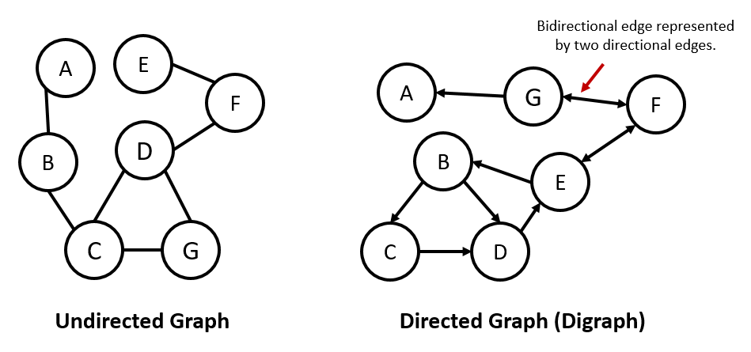
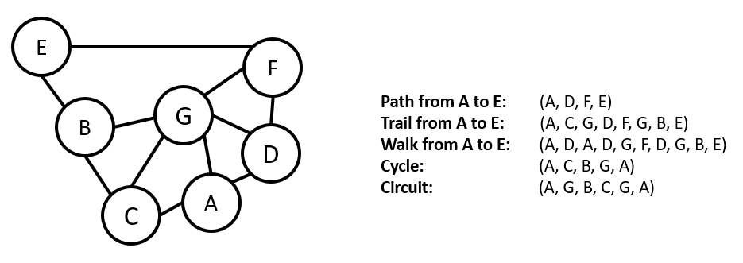
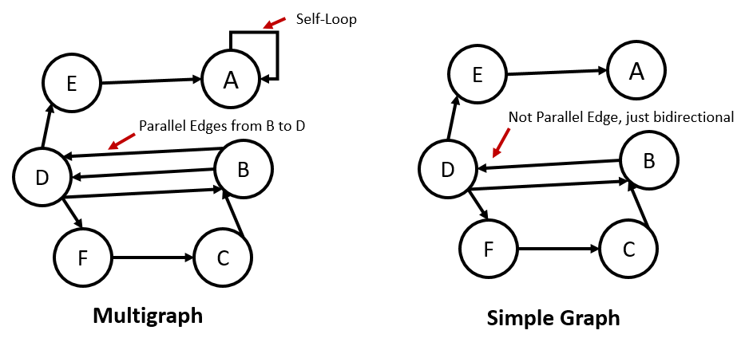
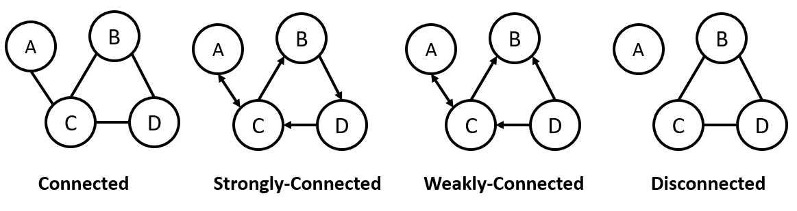
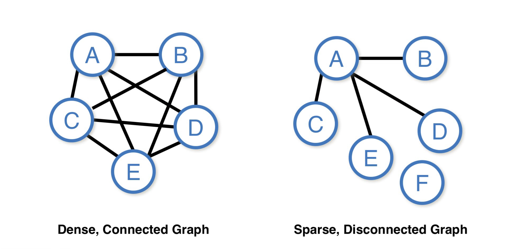
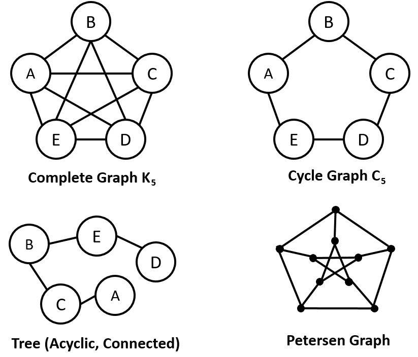

# Graphs

## Graph Terminology

* A *graph* $G = \left(V, E\right)$ consists of a set $V$ of *vertices* and a relation $E$ which determines the *edges* between vertices.
    * A *directed* graph (or *digraph*) is one in which we may have an edge pointing from a verex $u$ to a vertex $v$, denoted by $\left(u, v\right)\in E$, while not having an edge going in the opposite direction.
        * We draw a directed graph as a series of nodes with arrows between them.
    * An *undirected* graph is one in which, whenever $\left(u, v\right)\in E$, then $\left(v, u\right)\in E$.
        * When working with undirected graphs, we typically use $\left\lbrace u, v\right\rbrace$ to denote an *undirected edge*.
        * We can think of undirected graphs as directed graphs where each edge is *bidirectional*.
        * When we have an undirected graph, we omit the arrays on the edges.
    * A *subgraph* is a graph $G' = \left(V', E'\right)$ where $V'\subseteq V$ and $E'\subseteq E$ such that no edge in $E'$ relates to vertices outside of $V'$.

* When we talk about complexity when it relates to graphs, there are actually two parameters that we use.
    * The *order* of a graph is the number of vertices, so $\mathrm{Order}\left(G\right) = \left|V\right|$. We typically use $n$ to denote the order of a graph when giving asymptotic complexities for graph algorithms.
    * The *size* of a graph is the number of edges, so $\mathrm{Size}\left(G\right) = \left|E\right|$. We typically use $m$ to denote the size of a graph when giving asymptotic complexities for graph algorithms.

* The *degree* (or, in some really old texts, *valency*) of a vertex $v$ is the number of edges incident to it (that is, going in/out of it), denoted $\mathrm{deg}\left(v\right)$.
    * When working with directed graphs, there are two separate concepts, the *in-degree* (or *in-valency*) and *out-degree* (or *out-valency*) are the number of edges going in/out (respectively) of the vertex.

* A *path* in a graph is a sequence of vertices.
    * A path from $u$ to $v$ will be denoted by $u \leadsto v$.
    * A *simple* path is a path where no vertex is repeated.
    * A non-simple path with no repeated edges is called a *trail*.
    * A non-simple path where edges may repeat is called a *walk*.
    * A *cycle* is a path where the first and final vertex are the same.
    * A *circuit* is a trail where the first and final vertex are the same.
    * A *cyclic graph* is a graph which has at least one cycle, while an *acyclic graph* has no cycles.

* Edges in a graph may has an associated value called the *weight* of the edge.
    * This is typically used to model cases where going down one edge may be costlier than going down another.
    * An example is a graph modeling connections between cities, where the weights are the distances between them.

* In a graph, a *self-loop* is an edge where the start and end vertices are the same.

* *Parallel edges* between vertices are edges which both connect the same vertices (and, in directed graphs, point in the same direction).
    * A bidirectional edge being modeled as two edges which point in opposite directions is **not** an example of parallel edges.

* A graph is *simple* if there are no self-loops or parallel edges.
    * We typically refer to simple graphs when we talk about graphs.
    * When we want to allow self-loops and/or parallel edges, we will instead refer to it as a *multigraph*.

* An undirected graph is *connected* if every pair of vertices has a path connecting one to the other.
    * This definition for directed graphs is called *weakly connected* because $u \leadsto v$ does not necessitate the existence of $v\leadsto u$.
    * When each pair has a path in **both** directions, we call the graph *strongly connected*.
    * A graph which is not connected (by any of the above notions) is *disconnected*.

* The *connected components* of a graph are all of the maximal (that is, containing as many vertices and edges as possible) subgraphs which are connected.

* A graph is *dense* if $m = \Omega\left(n^{2}\right)$ and *sparse* is $m = O\left(n\right)$.
    * Note that a graph where each pair of vertices are connected by an edge will have $\binom{n}{2} = \frac{n\left(n-1\right)}{2}{ \sim } n^{2}$ edges, which is why we define density in this way.
    * Since we won't be using these notions in this course, we'll leave further exploration of these concepts to the reader.

* A *complete graph* is a simple undirected graph in which every pair of vertices has an edge from one to the other.
    * When we know how many vertices we are, we talk of **the** complete graph on $n$ vertices, $K_{n}$.
    * We call such a formation, where each pair of vertices has an edge between them, a *clique*.
        * There are cases where a general graph may not be complete, but there may be cliques among some of the vertices.

* A *cycle graph* (not just "cyclic") is a graph whose edges form a cycle on the vertices.
    * When we know how many vertices we are, we talk of **the** cycle graph on $n$ vertices, $C_{n}$.

* A *tree* is an acyclic, connected graph.
    * A graph whose connected components are all trees is a *forest*.
    * A *leaf* in a tree is a node which has only one edge connected to it.

**Lemma.** A connected subgraph of a tree forms a tree.

**Proof.**

By definition, the subgraph is connected, and it cannot have any cycles, or else the original graph also has a cycle.

Therefore, any connected subgraph of a tree is connected and acyclic, hence a tree.

**QED**

**Proposition.** A tree with $n$ vertices has $n - 1$ edges (hence, is sparse).

**Proof.**

We'll prove this by induction.

Base Case ($n = 1$): Any graph, hence tree, with a single node has no edges.

Inductive Case: Suppose this proposition holds up to some $n\geq 1$. Consider a tree with $n + 1$ vertices.

Consider the subgraph of our tree that we get from removing a leaf node. Removing the leaf node maintains connectedness, and so we have a tree with $n$ nodes. By our inductive hypothesis, this is a tree with $n-1$ edges, and so our full tree has $n$ edges, as required.

**QED**

* In the image below is another graph, called the [*Petersen graph*](https://en.wikipedia.org/wiki/Petersen_graph).
    * This graph won't be important for our course, but is included as it is an interesting graph in its own right.

## Graph Representations

* Now that we've looked at graphs as a mathematical object, let's think about how to represent them in a way that can be computed on.

* Graphs, in computer science, are treated, generally, as nonlinear data structures, and can be used to model many different things.
    * In particular, trees and linked lists are graphs.
    * This suggests that we can represent graphs via linked-node structures.
        * Is there anything better?

* A graph, as an abstract data type, needs methods to return information about the graph, such as the number of vertices/edges, the vertices/edges themselves, etc., as well as ways to mutate the graph by inserting or deleting vertices/edges.

* The way that we store this information can make some methods more efficient than others, or may be more or less efficient depending on the structure of the graph.

* Three common representations of graphs:
    * *Adjacency Matrix*: A matrix whose entries represent the relationships between vertices, such as the existence of edges.
        * If we label to the rows and volumns of our matrix by vertices and we enumerate then as $v_{1},\ldots, v_{n}$, the $A_{ij}$ entry of our matrix tells us if there's an edge from $v_{i}$ to $v_{j}$. If we allow multiple edges, then the entry can tell us how many edges there are.
        * If we don't allow multiple edges between vertices, then our entries can be 0/1 (no/yes).
            * If we have weights on the edges, then we can use the weights as our entries.
        * In an undirected graph, adjacency matrices are symmetric.
        * Adjacency matrices work well if our graph is dense.
            * Otherwise, we use up a lot of space, $O\left(\left|V\right|^{2}\right)$, just to store a few non-zero entries.
        * The adjacency matrix is also inefficient when it comes to adding or removing vertices.
    * *Adjacency List*: A list whose entries are lists showing the relationships between vertices.
        * If we enumerate out vertices as $v_{1},\ldots, v_{n}$, then the $i\rm{th}$ entry of the list is a list containing all of the vertices adjacent to $v_{i}$.
        * This is very efficient for sparse graphs, and allows for adding/removing vertices.
    * *Edge List*: A list of all of the edges.
        * Instead of storing vertices directly, we store the edges between vertices.
        * This means that we "lose" isolated vertices.

**Next: [Depth-First Search](./23.DFS.md)**