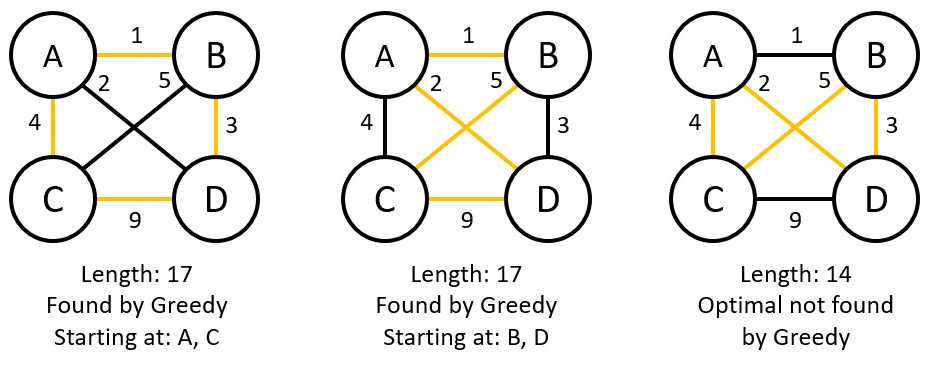

# Prim's Algorithm & The Greedy Paradigm

## Minimum Spanning Trees

* We will only be looking at weighted, undirected graphs.

* A *spanning tree* in a connected weighted graph $G = \left(V, E\right)$ is a tree $T = \left(V, E'\right)$ where $E'\subseteq E$.
    * In other words, it's a tree that contains every vertex of $G$ and is made using only edges of $G$ (no new edges are added).
    * We could talk about a *spanning forest* for a disconnected graph.
        * In fact, the algorithms we discuss will automatically do that for us.

* A *minimum* spanning tree (MST), then, is a spanning tree where the total sum of weights of the edges is as small as possible.

## Prim's Algorithm

* *Prim's algorithm* is very similar to Dijkstra's algorithm.
    * The main difference is that Dijkstra's algorithm optimizes cumulative distances, while Prim's algorithm will optimize over newly found edges.
    * This means that the priority queue we use will only store an edge weight rather than the sum total of all edge weights on the path to a particular vertex.

* An important concept that we'll need to consider is that of a *cut* in a graph.
    * A cut is a partitioning of vertices in a graph into two subgraphs, together with the edges connecting one subgraph to the other.
    * One way to think of it is two groups of cities that are separated by a river, and so the cut groups the cities on either side of the river together.
        * In this analogy, the edges between the groups are bridges.

* Any MST must contain the minimum-weight edge between subgraphs left from **any** graph cut.
    * This is known as the *cut property*.

* We will show a version of Prim's algorithm that is similar to the initial Dijkstra's algorithm from before and leave the optimized version as an exercise for the reader.
    * The algorithm makes use of a Visited Set `VS`, an Edge Set `ES`, and a Priority Queue `PQ`.

* `Prim(G)`:
    * Choose a vertex `s` from `V`.
    * Initialize `VS`, `ES`, and `PQ` to be empty.
    * for each `v` such that $\left(s, v\right)\in E$:
        * `PQ.enqueue((s, v), w(s, v))`
    * `VS.add(s)`
    * while `PQ` not empty and `VS.size() < n`:
        * `u, v = PQ.dequeue()` (we don't need the weight, it was just used as the priority)
        * if `v` not in `VS`:
            * `VS.add(v)`
            * `ES.add((u, v))`
            * for each `x` such that $\left(v, x\right)\in E$:
                * `PQ.enqueue((v, x), w(v, x))`
    * return `ES`

* Because Prim's algorithm is so similar to Dijkstra's algorithm, it seems obvious that it should also be correct and the time and space complexities should be the same (in both this and the optimized versions).
    * Verifying these is, again, left as an exercise for the reader.
    * To prove correctness, recall the proof of Dijkstra's algorithm, as well as the cut property mentioned above.
    * To prove the complexities, basically copy/paste the arguments for Dijkstra's algorithm.

## The Greedy Paradigm

* Prim's algorithm is an example of what's called a *greedy algorithm*.

* A greedy algorithm is one which, in some sense, is lazy:
    * Instead of spending time to work out a completely optimal choice (the *global optimal*), it instead chooses what looks optimal (the *local optimal*) at each step.
    * Because of this, greedy algorithms are generally easy to program.
    * There are many types of problems for which greedy algorithms are actually optimal, while others are not.
    * In this case, the "greediness" of Prim's algorithm is actually quite fast.

* One case where the greedy algorithm doesn't solve our problem is the *Traveling Salesman Problem* (TSP).

### Traveling Salesman Problem

* Suppose a salesman is traveling between cities to sell wares.
    * The salesman has a map (graph) and can tell the distance (edge weights) between cities (vertices).

* When given a weighted graph $G$ (a map of a group of cities), TSP asks:
    * How can the salesman travel the shortest distance while visiting every city exactly once?
    * In other words, how can we make a path such that every vertex of the graph is visited exactly once and the total edge weight of this path is minimal?

* The greedy algorithm doesn't always give the best choice, as seen in the diagram below:

* If we relax our problem in two ways, there are ways to get decent solutions.
    * First, we restrict our graphs to be *metric*, meaning that the weight of an edge `(A, B)` is shorter than the sum of the weights of edges `(A, C)` and `(C, B)`.
        * In other words, taking detours never reduces distance.
    * Second, instead of requiring an exact answer, we're okay with an approximation.
    * See: [Christofides algorithm](https://en.wikipedia.org/wiki/Christofides_algorithm)

**Next: [Kruskal's Algorithm & Union-Find](./27.Kruskal.md)**