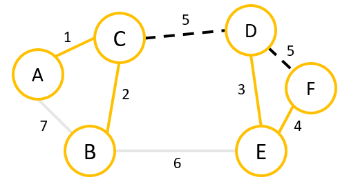

# Kruskal's Algorithm & Union-Find

## High-Level View of Kruskal's Algorithm

* Kruskal's Algorithm can be explained rather simply:
    * Given a graph with edges sorted in increasing weight, take edges in order and, if a cycle would not be formed, add it to the MST.

* There are a couple of issues with this:
    1. Edges are typically not sorted by default.
    2. How do we detect cycles efficiently?

* For the first part, we can do a couple of things:
    * When given a graph, we can place edges into a priority queue, where we'd incur an $O\left(m \lg m\right)$ runtime.
    * *If* the edge weights are small integers, we can use Radix Sort (mentioned but not discussed much in [a previous note](./18.DivideAndConquerSortAnalyses.md)), incuring only an $O\left(m\right)$ runtime.
    * This second strategy will be more important later when it comes to highly optimized forms of the data structure we'll be introducing in this note.

* For the second part, note that trees cannot contain cycles, which motivates the *cycle property*:
    * For any cycle in a graph, the edge with the highest weight (assuming distinct weights) will **not** be contained in any MST.
    * This is because we have to exclude at least one edge from the cycle, and so we'll want to exclude whatever weighs us down the most.

* Unfortunately, the Visited Set we used for Prim's algorithm no longer works.

* In the above example, we have taken the edges which have the lowest weights, and are left with 4 edges, where the two lowest-weight edges are weight 5.
   * Every vertex is marked, so the typical visited set logic would not finish the MST.
   * The reason why the Visited Set worked before is that we built up from a source vertex.
   * Kruskal's, on the other hand, constructs clusters of vertices globally without a care for if the next edge in consideration is incident to either of the vertices the last edge contained.

* Because of this, we need a new data structure.

## Union-Find

* We can phrase this cycle problem as an instance of a more general problem:
    * Let $S = \left\lbrace s_{1},\ldots, s_{n} \right\rbrace$ be a set with $n$ elements.
    * We're given a *partition* $S$.
        * A partition of a set is a collection of subsets which are pairwise disjoint and whose union is the whole set.
    * We want to efficiently update the sets in our partition as we merge them together.

* For Kruskal's algorithm, $S = V$ and the initial partition is $\left\lbrace \left\lbrace v_{1}\right\rbrace, \ldots, \left\lbrace v_{n}\right\rbrace \right\rbrace$, the collection of all singleton sets of the vertices of our graph.

* As we collect edges for an MST, we are merging our subsets.
    * This merging of subsets is called a *union*.
        * If you are familiar with basic set theory in mathematics, this is precisely that.
    * The merged subsets that we find at any point when running Kruskal's algorithm are in one-to-one correspondence with the clusters of our graph that have been collected by adding edges to (what will become) the MST.

* The data structure we need to replace the visited set has two goals:
    * We want to efficiently detect if two elements of our set are in the same partition set.
        * In our graph context, we want to be able to check whether vertices are connected in our (work-in-progress) MST.
    * We want to efficiently union partition sets together.
        * In our graph context, we want to be able to add an edge to our MST that connects two previously-disconnected clusters of vertices.

* To do this, we select a vertex from each cluster to act as that cluster's *representative*.
    * As an aside: For the mathematically curious among you, there's a separate-but-equivalent notion of an *equivalence relation*.
        * A lot of the terminology in this part of our note is *very much* connected to the sort of set theory one would pick up in a foundations of mathematics course.
        * If you're really curious, I recommend picking up "How To Prove It" by Daniel Velleman.

* If we want to see if two elements are in the same partition set, we just check to see if they have the same representative element.
    * This is called the *find* operation.

* Merging two partition sets together is the *union* operation.
    * Hence, our data structure is called the *Union-Find* data structure.

### How To Implement Union-Find

* Recall that, when we studied trees before we got into all of this graph business, we called a node **the** root.
    * In general, there is no unique root, we just distinguished a particular node by putting an orientation on the edges (saying that we were going from a parent node to a child node).

* What if, instead of pointing parent-to-child, we had every node point up to its parent?
    * In this case, we can distinguish the representative element by the node with no parent.
    * We can check if two elements are in the same partition set by climbing up to their root.
    * We can merge two partition sets by having one representative point to the other.

* Therefore, we will be maintaining a forest of partition set trees.

* Therefore, we have the following:
    * `find(v)`: To find the representative of `v`'s partition set, follow the path to the root node and return it.
        * To efficiently access `v`'s node in our forest, we can use a HashMap.
    * `union(u, v)`: To merge the sets containing `u` and `v`, we find `u' = find(u)` and `v' = find(v)`, and then have (for example) `u'.parent = v'`.

* While this does give us a way to store our disjoint sets, it isn't very efficient.
    * We have a worst-case $O\left(n\right)$ runtime if we've unforunate enough to form linked lists.
    * How can we fix this?

#### Path Compression and Rank

* Two optimizations can be made:
    * *Path compression*: Whenever we `find(v)`, take the time to push all the nodes we see along the way "up" to the level below the root.
        * Now we'll be using recursion to climb the tree instead of iteration so that we can make use of a technique that we used for AVL trees.
    * *Union-by-Rank*: When performing `union(u, v)`, make the larger tree's root the root of the smaller tree, that way our lowest nodes aren't being "pushed down" another level.
        * We'll need to store the height of each tree at the root, but since path compression makes this height inaccurate, we'll just call it the *rank*.

* So, to update our implementation, we do the following:
    * `find(v)`: Same as before, but now we use pointer reinforcement to return the root at as we unwind our recursion and redirect each node to point directly to the root before passing it down to the previous node in our path.
    * `union(u, v)`: Each node starts with a rank of 0. We check if `rank(u) < rank(v)` or vice-versa.
        * If so, we make the smaller-ranked root a child of the larger-ranked root and leave the rank unchanged.
        * If the ranks are equal, then we choose either one to become the child of the other, and then increase the now-solo root node's rank by 1.

#### How Efficient Is This?

**Theorem.** The `find` and `union` operations of Union-Find with Path Compression and Union-By-Rank have an amortized complexity of $O\left(\alpha\left(n\right)\right)$.

* What is $\alpha\left(n\right)$?
    * This is an *insanely, ridiculously, recklessly, insanely slow growing* function called the [*inverse Ackermann function*](https://en.wikipedia.org/wiki/Ackermann_function#Inverse).
        * If you get the reference, then you know the password to the midnight meetings on Fridays under the Brooklyn Bridge.
        * I'll leave the actual details to the videos below, but basically $\alpha\left(n\right) \leq 4$ for $n \leq 2^{2^{2^{2^{16}}}} = 2^{2^{2^{65536}}}$.

* Historically, Hopcroft and Ullman initially proved this theorem with a different growth function, the [*iterated logarithm*](https://en.wikipedia.org/wiki/Iterated_logarithm) $\lg^{*} n$, which is already an incredibly slow growing function.
    * $\lg^{*} n \leq 5$ for $n\leq 2^{2^{2^{2^{2}}}} = 2^{65536}$.

* But, as he usually does, Tarjan shows up with a more fine-tuned analysis of the same algorithms to prove that, actually, it's even better!

* The proof of this theorem is beyond the scope of this course, but here are some links to see it (from [Algorithms Illuminated](https://www.algorithmsilluminated.org/) by Tim Roughgarden):
    * [Union-by-Rank](https://www.youtube.com/watch?v=6HI120fms84) and [Analysis](https://www.youtube.com/watch?v=OdmJfUE9a2g)
    * [Path Compression](https://www.youtube.com/watch?v=13habRPrHcc) and the Hopcroft-Ullman Iterated Logarithm Analysis ([Part 1](https://www.youtube.com/watch?v=Yfz3-RWXy_s) / [Part 2](https://www.youtube.com/watch?v=0Hlx_R48RGM))
    * [The Ackermann Function](https://www.youtube.com/watch?v=_xzMZdwohF4)
    * Tarjan's Inverse Ackermann Analysis ([Part 1](https://www.youtube.com/watch?v=9TyXnY3dPWo) / [Part 2](https://www.youtube.com/watch?v=8c4OTc9PGpY))

## Kruskal's Algorithm

* `Kruskal(G)`:
    * Initialize a disjoint set `DS` (union-find data structure) with vertices.
    * Initialize edge set `MST` to be empty.
    * Sort the edges in increasing order by weight in an array `Edges`.
    * for `i = 0...m-1` and while `MST` has < `n-1` edges:
        * `(u, v) = Edges[i]`
        * if `find(u) != find(v)`:
            * `MST.add((u,v))`
            * `union(u, v)`

* How efficient is Kruskal's Algorithm?

**Theorem.** Assuming arbitrary edge weights that can be compared in $O\left(1\right)$ time and edges provided in unsorted order, Kruskal's Algorithm takes $O\left(m \lg m\right)$ time.

* This is because we have to sort the edges, which means the comparison bound for sorting limits our efficiency.

* So why did we do all of that stuff with Union-Find then?

**Theorem.** If edges are already sorted or the weights are integers that are small enough so that Radix Sort can be done in $O\left(m\right)$ time, then Kruskal's Algorithm takes $O\left(m \alpha\left(n\right)\right)$ time.

* Proving this is trivial if we use the Union-Find bound (either by just believing it or following the videos above).

## Prim vs Kruskal

* When our graph is dense, $m = \Omega\left(n\right)$, so the $O\left(m \lg n\right)$ runtime of Prim's algorithm is better than the $O\left(m \lg m\right)$ runtime of Kruskal's algorithm, assuming the edges don't cooperate to make use of Union-Find's efficiency.

* When our graph is sparse, $n = \Omega\left(m\right)$, so Prim's algorithm is $O\left(n \lg n\right)$ which may be worse than Kruskal's $O\left(m \lg m\right)$.

* If the edges come presorted due to some structure of whatever particular circumstance we're working in, then Kruskal's algorithm clearly comes out on top.

* On the other hand, if our sorting algorithm is out-of-place (such as using a priority queue) and our graph is huge, then the memory usage of Kruskal's algorithm might not be advisable over Prim's algorithm.

* There are a lot of different things to look at in practice to determine what's right for your problem, so be on the lookout.