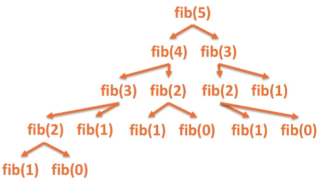
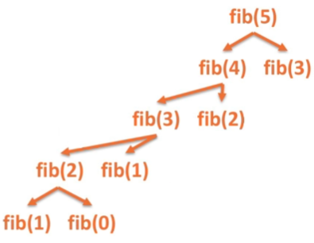
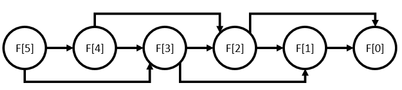

# Dynamic Programming

* *Dynamic programming* (DP) is a technique in algorithm design whereby a problem which naturally breaks into smaller versions of itself can be solved by making efficient use of solutions of those smaller versions, called *subproblems*.
    * DP works best when the subproblems have significant overlaps where we can save time by remembering the solutions in those overlapping parts.
    * This saving of overlapping subproblems is called *memoization*, because we're writing solutions down in a memo for later use.

* A problem has *optimal substructure* if finding the optimal solutions to its subproblems form the optimal solution to the whole problem.
    * An example that we've already seen is the shortest path problem, which we solved using Dijkstra's algorithm.
    * In Dijkstra's algorithm, we took advantage of the fact that the shortest path from the source $s\in V$ to any other $v\in V$ is made by finding all of the shortest paths for each vertex along the way.

* We make use of these three components:
    1. Identify the optimal substructure of the problem.
    2. Establish an order of solving.
    3. Solve subproblems to solve the overall problem.

* We can use memoization to save solutions to subproblems to speed up other subproblems where they overlap.
    * In this sense, DP can be thought of as divide & conquer, but with some extra space to keep track of answers to make future subproblems faster.
    * In fact, a divide & conquer algorithm can be thought of as a DP where we have a memo pad that isn't used.

* The prototypical example is calculating the $n\rm{th}$ Fibonacci number.

## Fibonacci Sequence

* `fib1(n)`:
    * if `n <= 1`: return `n`
    * return `fib(n-1) + fib(n-2)`

* What is the time complexity of this algorithm?

* Each node in this tree corresponds to an instance of our recursive Fibonacci function.
    * Notice that we have to re-calculate lower values many times.
    * This is wildly inefficient.

* We can write a recurrence for the runtime:
    * $T\left(n\right) = T\left(n - 1\right) + T\left(n - 2\right) + O\left(1\right)$
    * Notice that this is essentially the Fibonacci sequence with a little extra bit at the end.
    * Recall from the [AVL Tree Notes](./14.AVLTrees.md) that $F_{n}{\sim}\frac{\varphi^{n}}{\sqrt{5}}$, which is exponential.
    * Therefore, the runtime of this algorithm is exponential!

* Clearly, the issue here is that we're redoing work that we don't have to.
    * When we calculate `fib(k)` once, we shouldn't have to do it again.
    * This is where memoization comes to play!

* Suppose we have some global HashMap called `Fib`, which we initialize with `Fib[0] = 0`, `Fib[1] = 1`, and reimplement our algorithm to save values.

* `fib2(n)`:
    * if `n` not in `Fib`:
        * Set `Fib[n] = fib(n - 1) + fib(n - 2)`
    * return `Fib[n]`

* This looks (almost) linear!

* This approach, using recursion, is known as *top-down DP*.
    * We start from the "top" of tree and work our way down via recursion.
    * In practice, recursion isn't as good as iterating, because we have to set up a call stack.
    * Can we make this better?

* Suppose we've initialized some global state array `Fib` with `Fib[0] = 0`, `Fib[1] = 1`.

* `fib3(n)`:
    * if `n >= Fib.size()`:
        * Set `m = Fib.size()`
        * `Fib.resize(n+1)`
        * for `i = m ... n`:
            * `Fib[i] = Fib[i-1] + Fib[i-2]`
    * return `Fib[n]`

* This approach, using iteration, is known as *bottom-up DP*.
    * Instead of starting from the top, we work our way from the bottom of where the recursive calls would end up, and iterate up to where we need to go.
    * This is faster in practice because we don't have the extra overhead of setting up a stack for each recursive call.

* Both forms of DP give the same $O\left(n\right)$ time and space complexity for calculating values of the Fibonacci sequence.
    * Technically, we could get rid of the space requirement if we know that we'll only be calling this function once.
    * `fib4(n)`:
        * if `n <= 1`: return `n`
        * Set `a = 0`, `b = 1`
        * for `i = 2 ... n`:
            * `temp = a + b`
            * `a = b`
            * `b = ret`
        * return `b`
    * This implementation iteratively calculates $F_{n}$ in $O\left(n\right)$ time and $O\left(1\right)$ extra space.
    * This would be best if you won't be needing this function more than once during any run of your program.

## The Implicit DAG

* When considering subproblems, can construct a directed, graph using the subproblems as vertices and directed edges from a problem to its direct subproblems.

* When this directed graph is acyclic (making it a directed, acyclic graph, or *DAG*), then DP techniques can be used.
    * This is because, when cycles are not present, we have clear lines from our original problem down to its base cases to resolve everything in a well-defined order.
    * This property of DAGs is described as being *topologically sorted*.

* We can think of top-down DP as using DFS to search for base cases and storing the solutions as it returns from recursive calls.

* Bottom-up DP sorts the order of the subproblems ahead of time so that one can iterate over them without worrying about unresolved dependencies.

* This DAG view of DP problems also makes the connection to divide & conquer techniques more apparent.
    * If our DAG is actually a directed tree, memoization is no longer required, and our DP is actually just Divide & Conquer.

## Some DP Problems

* Now let's look at a few problems where DP techniques can be used.

### Largest Contiguous Sum

* Suppose we have an integer array $A$ of length $n$.

* We want to compute the largest sum possible with a contiguous chunk of the array (non-circular, so we don't consider the first and last elements as a contiguous block).
    * Note that we take the empty sum to be 0, and is a valid answer (if all integers in the array are negative).

* Since the Fibonacci example had an obvious subproblem, we'll need to spend a little time trying to figure out what to do here.

* For a bit of notation, let $S$ be an array such that $S\left[k\right]$ is optimal solution for subproblem $k$.
    * When we solve the full problem, we'll take the maximum of these subproblems.

* Our first guess might be, for each $k < n$, we should define $S\left[k\right]$ to be the largest contiguous sum for $A\left[0:k\right]$.
    * Consider the array $\left[ -1, 2, -1, 4, -3, 1, 3 \right]$.
    * With this subproblem definition, we get $S = \left[ 0, 2, 2, 4, 4, 4, 4 \right]$
    * This suggests that 4 is our answer, but the actual largest contiguous sum is $\mathrm{sum}\left(A\left[1:6\right]\right) = 6$.
    * The issue with this subproblem definition is that we don't consider contiguous blocks with negative entries.

* To fix this, let's redefine our subproblem:
    * For our base case, let $S\left[0\right] = \max\left\lbrace 0, A[0]\right\rbrace$.
    * For $0 < k < n$, let $S\left[k\right] = A[k] + \max\left\lbrace 0, S[k-1]\right\rbrace$
    * What this does is *force* our algorithm to take some negative values as we reach them, only discarding them when they take away too much.

* Let's consider a couple of examples:
    * For the array $\left[ -1, 2, -1, 4, -3, 1, 3 \right]$, we get $S = \left[ 0, 2, 1, 5, 2, 3, 6 \right]$, which gives us a maximum value of 6 (correct!).
    * For $\left[ -1, -2, 1, 4, -2, -4, 1, 3 \right]$, we get $S = \left[ 0, -2, 1, 5, 3, -1, 1, 4 \right]$, which gives us a maximum value of 5 (also correct!).

* With this, we can come up with an algorithm!

* `largest_contiguous_sum(A)`:
    * Set `n = A.size()`
    * Make array `S` of size `A.size()`.
    * Set `S[0] = max{0, A[0]}`.
    * for `k = 1...n-1`:
        * `S[k] = A[k] + max{ S[k-1], 0 }`
    * return `max(S)`

**Proposition.** This algorithm correctly computes the largest contiguous sum of any array of integers and has time and space complexity $O\left(n\right)$.

* Can we do better?
    * Sure, we can save some space!

* `largest_contiguous_sum2(A)`:
    * Set `n = A.size()`
    * Initialize `global_max, local_max = 0`
    * for `k = 0 ... n-1`:
        * if `global_max < 0`: Set `global_max = 0`
        * if `local_max < global_max`: Set `local_max = global_max`
        * `global_max += A[k]`
    * if `local_max > global_max`: Set `global_max = local_max`
    * return `global_max`

* A C implementation can be found [here](../dynamic_programming/largest_contiguous_sum.c).

### Longest Increasing Subsequence (LIS)

* Suppose we have an integer array $A$ of length $n$.

* Define a *subsequence* of an array to be a sequence of elements of the array in the order that they appear.
    * These elements need not be contiguous.
    * For example, one subsequence of $\left[ 1, 2, 5, 7, 9, -1, -10, 8 \right]$ is $\left[ 1, 9, -10, 8 \right]$, while $\left[ -1, 1, -10, 8 \right]$ is not, because the $1$ is in the wrong spot.

* We want to find the length of the *longest increasing subsequence* of $A$.
    * In other words, we want to know the length of the largest subsequence of $A$ such that the elements are in increasing order.

* Again, we'll use $S\left[k\right]$ to denote the optimal solution for subproblem $k$.
    * In this case, it turns out the first guess of letting $S\left[k\right]$ be the longest increasing subsequence of $A\left[0:k\right]$ works this time.

* With this definition of $S\left[k\right]$, we see that

$$S\left[k\right] = 1 + \max_{\substack{0\leq j \leq k\\\ A[j] < A[k]}} \left\lbrace S\left[j\right]\right\rbrace.$$

* Then, the solution is $S\left[n - 1\right]$.

* With this, we get the following algorithm.

* `longest_increasing_subsequence(A)`:
    * Initialize array `S` to size `n = A.size()`.
    * for `k = 1...n-1`:
        * Set `T = 0`
        * for `j = 0...k`:
            * if `A[j] < A[k] && T < S[j]`:
                * Set `T = S[j]`
        * `S[k] = 1 + T`
    * return `S[n - 1]`

**Proposition.** This algorithm correctly computes the length of the longest increasing subsequence of any array of integers and has time complexity $O\left(n^{2}\right)$ and space complexity $O\left(n\right)$.

* A C implementation can be found [here](../dynamic_programming/LIS.c).

### Longest Common Subsequence (LCS)

* Given two strings $A$ and $B$ of sizes $m$ and $n$, respectively, we want to know their *longest common subsequence* (LCS).
    * Here, we're treated strings as sequences of characters.
    * Recall that a subsequence is a not-necessarily-contiguous sequence of elements in the order they were found originally.
    * A *common subsequence* in two sequences is a third sequence that is a subsequence of both of the original two.
        * The longest common subsequence, then, is a common subsequence of longest length.

* Brute forcing is *not* a good idea, because there are $2^{n}$ subsequences of a sequence of size $n$.
    * Hence, this would take $O\left(2^{m} + 2^{n}\right)$ time.

* Let's try DP!

* We define a *substring* of a string to be a subsequence made up of a contiguous elements.

* We'll find an LCS by first calculating its length and then using the information to build it.

* For subproblems, since we need to keep track of two elements, we'll actually have a 2D array $S\left[i, j\right]$ of subproblems.
    * $S\left[i, j\right]$ is the length of the longest common subsequences of $A\left[0:i-1\right]$ and $B\left[0:j-1\right]$.
    * The empty string is technically a substring, and so $S\left[0, j\right] = 0 = S\left[i, 0\right]$ for all $i, j$.

* Whenever we find a match at indices $i, j$, we set $S\left[i, j\right] = 1 + S\left[i-1, j-1\right]$.
    * This corresponds to the same sequence of characters we're currently on sans the most recent character (which is what the additional 1 adds for us).

* If we don't find a match at indices $i, j$, we set $S\left[i, j\right] = \max\left\lbrace S\left[i-1, j\right], S\left[i, j-1\right] \right\rbrace$, where ties are broken by always selecting $S\left[i-1, j\right]$.
    * $S\left[i-1, j\right]$ corresponds to the sequence of characters obtained by the character one spot to the left of string $A$.
    * $S\left[i, j-1\right]$ corresponds to the sequence of characters obtained by the character one spot to the left of string $B$.
    * By always choosing the first option when we have a tie, we can recreate the subsequence by moving backwards from the bottom right going up and left while `S[i][j] != 0`, picking direction based on whichever is larger each time.
    * We could, instead, default to the other option, which could potentially give a different subsequence of the same length.

* `LCS(A, B)`:
    * Set `m = A.size()`, `n = B.size()`
    * Initialize 2D array `S` of size `(m + 1) x (n + 1)` to 0.
    * for `i = 1...m`:
        * for `j = 1...n`:
            * if `A[i-1] == B[j-1]`:
                * Set `S[i][j] = 1 + S[i-1][j-1]`
            * else:
                * if `S[i-1][j] < S[i][j-1]`:
                    * Set `S[i][j] = S[i][j-1]`
                * else:
                    * Set `S[i][j] = S[i-1][j]`
    * Create a string `S` of length `S[m][n]`.
    * Set `i = m`, `j = n`, `k = S[m][n] - 1`.
    * while `k > 0`:
        * if `A[i-1] == B[j-1]`:
            * `S[k] = A[i-1]`
            * `i--`, `j--`, `k--`
        * else:
            * if `S[i-1][j] < S[i][j-1]`: `j--`
            * else: `i--`
    * return `S`

* A C implementation can be found [here](../dynamic_programming/LCS.c).