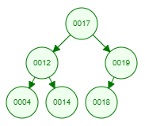

### Tree Traversals
* Suppose we have a `process(Node)` method which may depend on the order we traverse our tree (it could be as simple as printing the data). The following sections will show how to use this in all of the orders mentioned in the previous notes.

* The traversal order will be shown for each method for the following example BST (special thanks to USFCA's [Algorithm Visualizations](https://www.cs.usfca.edu/~galles/visualization/Algorithms.html) for making a [BST visualization tool](https://www.cs.usfca.edu/~galles/visualization/BST.html)):



#### Depth (Recursive, Stack-Based) Traversals
* Recall the Depth Traversals from the previous notes:
    * Preorder Traversal - The `root` node is processed, followed by (recursively) the `left` subtree and the `right` subtree, respectively.
    * In-order Traversal - We recursively process the `left` subtree from `root`, then we process `root`, and, finally, we process the `right` subtree.
    * Postorder Traversal - We recursively process the `left` subtree from `root`, then the `right` subtree, and, finally, we process `root`.

* Each of these follow the same strategy: Exploit the recursive structure of the binary tree.

##### Preorder Traversal
* Suppose we want to process the data stored at each node with a preorder traversal.

```java
private void preorder_process(Node node) {
    if (node != null) {
        process(node);
        preorder_process(node.left);
        preorder_process(node.right);
    }
}

public void preorder_process_tree() {
    preorder_process(root);
}
```

* When this is run, we essentially get the following: `process(root)` -> `process(root.left)` -> `process(root.left.left)` -> . . . -> `process(root.left.right)` -> . . . -> `process(root.right)` -> . . . -> Done!

* The resulting traversal: `17 -> 12 -> 4 -> 14 -> 19 -> 18`

##### In-order Traversal
* Suppose we want to process the data stored at each node with an in-order traversal.

```java
private void inorder_process(Node node) {
    if (node != null) {
        inorder_process(node.left);
        process(node);
        inorder_process(node.right);
    }
}

public void inorder_process_tree() {
    inorder_process(root);
}
```

* When this is run, we essentially get the following: We recurse all the way to the left, at which point we process the left-most child node, then we process the parent of that node, followed by doing the same on the right subtree of that parent, until we work our way back up to the root, and do it all again on the right subtree.

* The resulting traversal: `4 -> 12 -> 14 -> 17 -> 18 -> 19`

##### Postorder Traversal

* Suppose we want to process the data stored at each node with an postorder traversal.

```java
private void postorder_process(Node node) {
    if (node != null) {
        postorder_process(node.left);
        postorder_process(node.right);
        process(node);
    }
}

public void postorder_process_tree() {
    postorder_process(root);
}
```

* When this is run, we essentially get the following: We recurse all the way to the left, at which point we process the left-most child node, then we process the parent of that node, followed by doing the same on the right subtree of that parent, until we work our way back up to the root, and do it all again on the right subtree.

* The resulting traversal: `4 -> 14 -> 12 -> 18 -> 19 -> 17`

#### Breadth (Iterative, Queue-Based) Traversals

* The previous traversals used a stack (implicitly) via recursion. Now, we will use a queue and iterate.

* The only such traversal we saw in the previous notes was:
    * Levelorder Traversal: We traverse each level of the tree iteratively.

##### Levelorder Traversal

* Suppose we want to process the data stored at each node with a levelorder traversal.

* We make use of Java's [`ArrayDeque<E>` implementation](https://docs.oracle.com/en/java/javase/22/docs/api/java.base/java/util/ArrayDeque.html) for a queue.

```java
public void levelorder_process_tree() {
    ArrayDeque<Node> queue;

    queue.add(root);

    while (!queue.isEmpty()) {
        Node node = queue.pollFirst();

        if (node == null) {
            continue;
        }

        process(node);
        queue.add(node.left);
        queue.add(node.right);
    }
}
```

* When this is run, we essentially get the following: `root` -> `root.left` -> `root.right` -> `root.left.left` -> `root.left.right` -> `root.right.left` -> `root.right.right` -> . . . -> Done!

* The resulting traversal: `17 -> 12 -> 19 -> 4 -> 14 -> 18`

#### Choosing Between Traversals

* Now that we've seen some methods of traversing a binary tree, how should we go about choosing the correct one for our needs? Note that we typically want to use these on BSTs because they reveal some important properties or have some convenient features.
    * The preorder traversal *uniquely identifies* a BST. Adding elements to a BST in order based on preorder traversal will give *the exact same BST*.
    * The inorder traversal does *not* uniquely identify a BST. However, it *does* returns the data in sorted order. Note that one should not (naively) insert items in this order, because this would lead to a degenerate BST.
    * The postorder traversal *uniquely indentifies* a BST. Removing nodes in this order would remove leaf nodes, which is helpful if we want to completely clear a BST without having to deal with inter-generational dependencies.
    * The levelorder traversal *uniquely identifies* a BST. As with preorder traversal, adding nodes in this order gives the exact same BST. And, while the postorder traversal goes straight to leaf nodes, the levelorder traversal allows for iteration in order of distance from the root, from left to right on each level.

* More complex methods can use these traversals as building blocks in BST implementations, as needed. As mentioned before, an important method in many data structures is the ability to clear the data structure, and postorder traversal seems especially useful for that.

**Next: [BST Operations](./9.BSTOperations.md)**